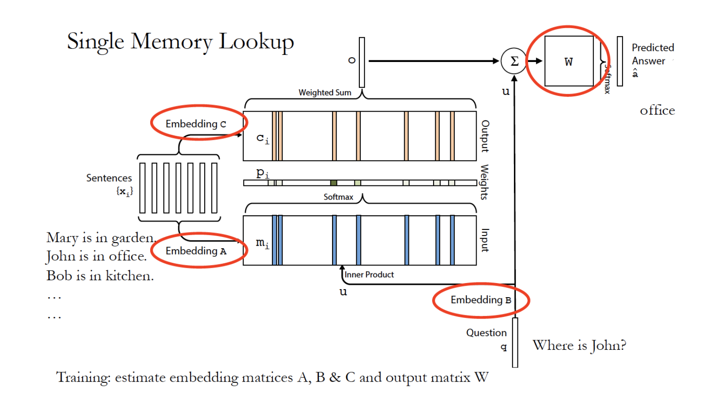

# tf_MenN2N

## Description
본 논문에서의 핵심 아이디어는 메모리 구성하고 인풋으로 부터 메모리의 어느 부분을 많이 참고하는지를 계산하여 대답을 예측하는 것이다.
모델을 좀 더 쉽게 이해할 수 있도록 single layer로 샘플 데이터를 사용하여 모델을 만들었다.

### query representation
쿼리는 문장으로 문장은 {단어1,단어2,..}로 구성되어있다.
embedding matrix로 단어들을 vector로 변환 한 뒤에 모두 합하여 하나의 vector로 만든다. 
즉 쿼리 1개 -> 1차원 vector가 생성된다.

### Input memory
Story를 이용하여 input memory를 구성하는데 Story = {문장1,문장2,...}로 구성되어 있고 문장 ={단어1,단어2,..}로 구성
query representation에서 수행한대로 모든 문장들을 vector로 변환하고 이 vector의 list들이 input memory가 된다.
이 단계에서도 embedding을 하게 되는데 query representation과 다른 embedding matrix를 사용한다.

### Output memory
input memory를 만들 때와 똑같이 수행한다. 같은 story를 사용 하지만 다른 embedding matrix사용

## Requirements

- Python 3.6
- TensorFlow 1.4

## Reference

- [End-To-End Memory Networks](https://arxiv.org/abs/1503.08895)

## Author
junbeomlee
